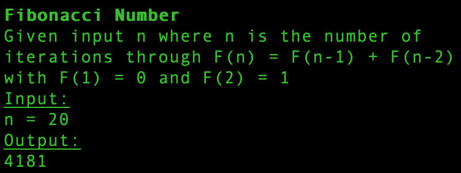

# algo_repo

### Created November 2020

### By longhike

## Description:

A set of algorthims I'm continually updating; uses Node to render examples to the console.

Currently included:
- reverse a string

- reverse an array

- palendrome checker

- fibonnacci number outputter

- get three largest integers in array of integers

- get prime numbers given range

- perform a binary search on array of integers to see if a given input is included in the array

- show five rows of a Floyd's Triangle

## Set-up & Installation requirements:

Node.js 

run `node script.js` or `npm start` in your terminal to view test-case results

## Known Bugs:

No known bugs.

## Support & Contact details:

e-mail long.hike.dev@gmail.com

## Technologies Used

Javascript

Node.js

## Contribution Guidlines 
​
n/a
​
### License
​
Copyright(c) 2020 By longhike.

This software is licensed under MIT license.
